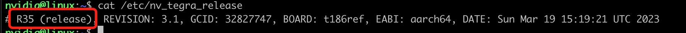

# Seeed Studio SenseCraft AI

**No Code Edge AI**

## Introduction

SenseCraft AI is a powerful artificial intelligence application designed for Recomputer (Jetson) devices.
It supports deployment on a wide range of Recomputer (Jetson) devices, ensuring that you have a wide choice of hardware.
In addition to several built-in AI models, we will be providing a large number of public models on the SenseCraft AI
platform in the future.
You can to download and deploy AI models for specific scenarios and create personalized AI solutions based on your
needs.
Create personalized AI solutions based on your needs.
SenseCraft AI is your intelligent decision-making partner, providing you with simple, flexible and efficient AI
reasoning and solution building capabilities.
and solution building capabilities. Using our apps, you will experience the power of intelligent decision making,
helping you to
You will experience the power of intelligent decision making to help you make informed and accurate decisions in a
variety of scenarios.

## Features

- Easily and conveniently deploy your AI model remotely and return video streams and inference results.
- Powerful remote management of devices.
- A user-friendly frontend interface that helps you quickly get started.
- Flexibility to configure multiple video streams and multiple cameras to meet a variety of visual AI needs, whether at
  home, in the workplace, or elsewhere.
- Auto-handling different input sources, such as MP4, IP cameras, and USB cameras.
- Simple and user-friendly MJPEG streaming output, accessible with just a browser, even on your phone.

## Project

[SenseCraft AI_Client](https://github.com/Seeed-Studio/SenseCraft-AI-webUI)

provides the necessary API endpoints and handles the business logic for the frontend application.

[SenseCraft AI_Server](https://github.com/Seeed-Studio/SenseCraft-AI-Edge)

An YOLO server running on your edge device, handling input and output, enabling model switching and parameter
configuration.

## **Hardware Requirements**

Adapts to any Jetson that deploys Jetpack 5.0.2 or higher.

## **Sofeware Requirements**

### Lt4 Version > R35 (Jetpack Version > 5.0.2)

[View L4t Version Detail](https://developer.nvidia.com/embedded/jetson-linux-r351)

Can use "cat /etc/nv_tegra_release" to find Lt4 version



### **How to reflash Jetpack 5.X**

[ReComputer_J4012_Flash_Jetpack | Seeed Studio Wiki](https://wiki.seeedstudio.com/reComputer_J4012_Flash_Jetpack)

### **Upgrade Jetpack 4.4, 4.5, 4.6 NX devices to Jetpack 5.X**

See [here](https://developer.nvidia.com/embedded/jetpack) for upgrade instructions.

## **Quickstart**

```shell
bash ./script/edge-ai-setup.sh
```

[](https://youtu.be/2qqYywttue4 "NetFlix on UWP")

Seeed Studio SenseCraft AI Script uses the following items:

- [Ultralytics_YOLOv8](https://github.com/ultralytics/ultralytics)
- [Watchtower](https://github.com/containrrr/watchtower)

## License

This project is released under the [MIT license](LICENSES).
